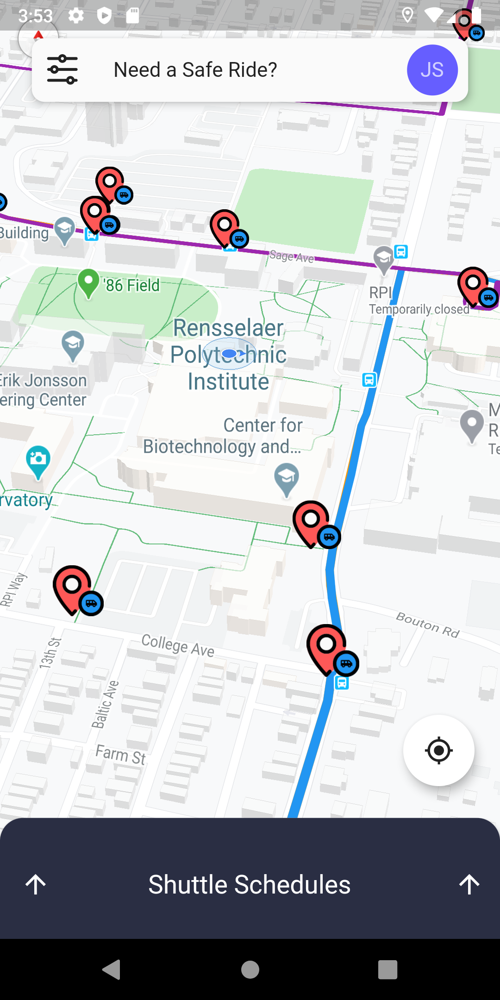

# smartrider 🚕

**The all-in-one RPI transportation app**

developed with [Flutter](https://flutter.dev/) and [Firebase](https://firebase.google.com/).

*Our goal is to make transportation in and around RPI safer and more intuitive.*

## Currently planned features:
- [ ] Allows you to call RPI saferide like uber.
- [x] Contains CDTA bus and RPI shuttle schedule.
    - [x] Allows you to search for specific departures.
    - [ ] Shows closest stops and estimated departure time in minutes.
- [x] Displays running routes on a map,
    - [ ] with live-update shuttle/bus locations.
- [x] Sexy UI
    - [x] Dark Mode
    - [x] Material Design
    - [x] 3D Map

Interact with our [mockups](https://xd.adobe.com/view/8a421d6f-ad6f-4196-7089-fff92621dc6f-fc73/?fullscreen)!

Visit the [Wiki](https://github.com/sirmammingtonham/smartrider/wiki) for dev install instruction!
